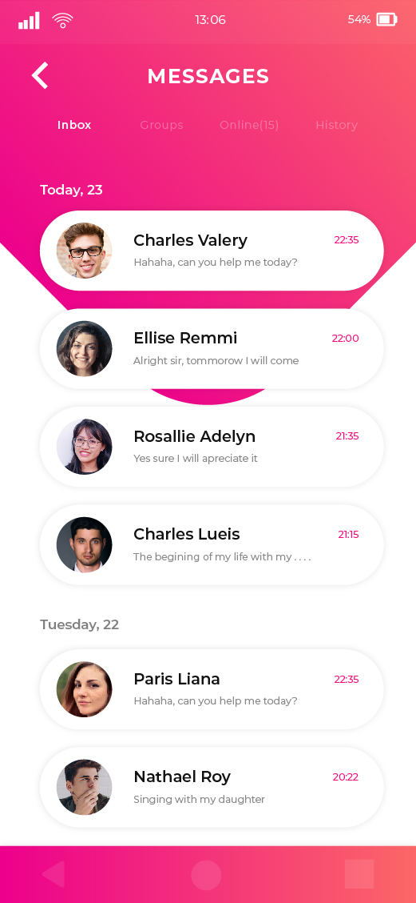
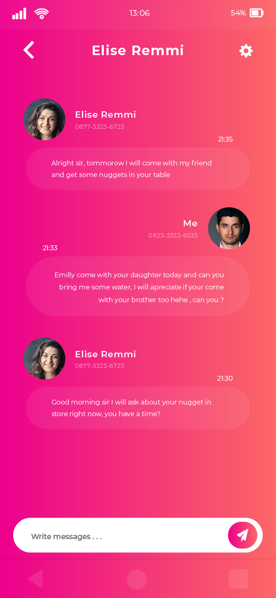

# flutter_ui_14_chat_ui_2

This is another chat UI which i have created in flutter.
 
**About the UI**:- 
When you open the app you have widgets aligned one over the other in a stack. The bottom most widget is a screen which has a design drawn on it with the help of Path. Over this we have the app bar tab bar navigation and list view which is holding chat items. The tab bar items are modified to match the designs. 
When we click on any of the chat screens we are taken to the next/final screen of the UI which is where the users can chat. The initial design is similar to the previous screen where we had stack. In this stack we have three items aligned one over the other. The bottom one is a gradiet screen over which we have the appbar and the chat items and on the top we have a container which is made for sending messages(not functional yet). The appbar design is almost same as that of the screen 1. The items are changed according to the design. 
___
Built in:-
* Flutter
___
Some snaps from the UI:-
* Full video:-
* Snaps:-

## Getting Started

This project is a starting point for a Flutter application.

A few resources to get you started if this is your first Flutter project:

- [Lab: Write your first Flutter app](https://flutter.dev/docs/get-started/codelab)
- [Cookbook: Useful Flutter samples](https://flutter.dev/docs/cookbook)

For help getting started with Flutter, view our
[online documentation](https://flutter.dev/docs), which offers tutorials,
samples, guidance on mobile development, and a full API reference.
